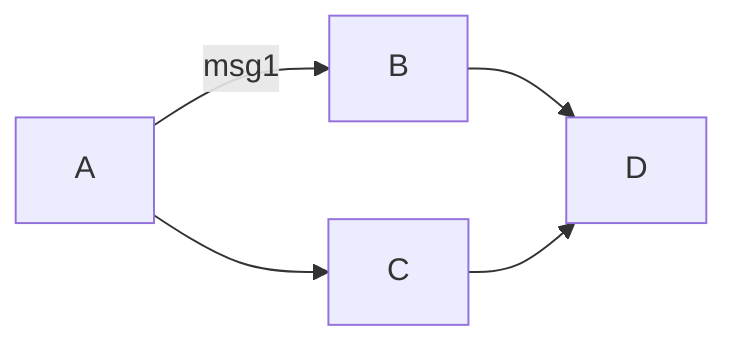
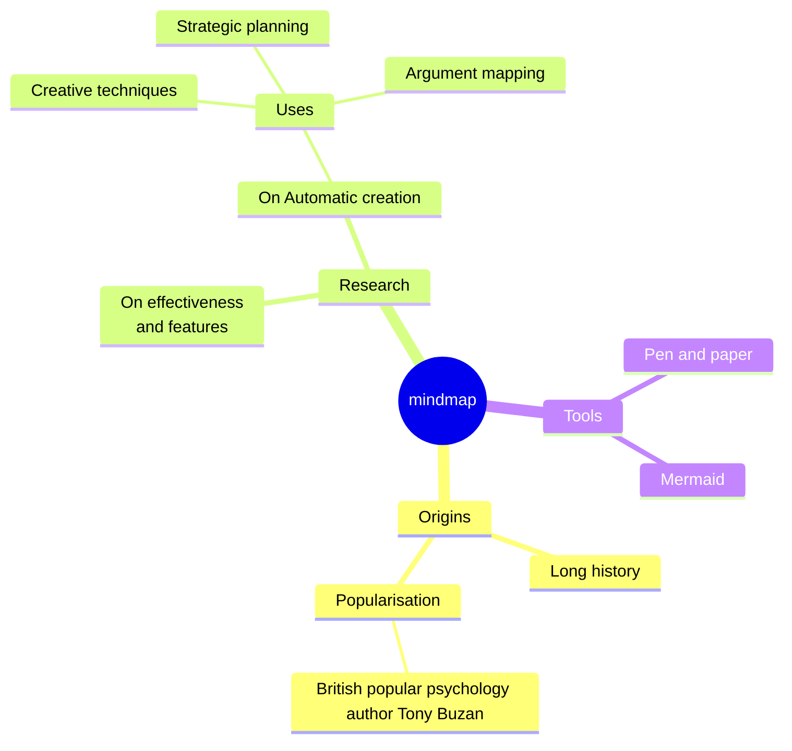

## 1.0 References
1. [basic](https://www.markdownguide.org/basic-syntax/)
2. [extended](https://www.markdownguide.org/extended-syntax/)
3. drawing diagrams
	1. [mermaid](https://mermaid.js.org/syntax/flowchart.html)


## 2.0 Components

### Structure
	- Headers
		- # , ##, ### etc

	- Hyphens: -
	- Bullets: *

	- Lists	
		1. item1
		2. item2


### Code blocks
	- Normal: 
```
	Line 1
	Line 2
```

	- Python: 
``` python
x = [ 2 * i for i in range(10)]
```

- Scala
``` scala
val x = Seq.empty[List]()
```


### Links
```
My favorite search engine is [Duck Duck Go](https://duckduckgo.com).
```
My favorite search engine is [Duck Duck Go](https://duckduckgo.com).


### Highlight Important Text
- add === around the text
	- Ex: This word is very ===important===
- add ** around text to bold
	- Ex: This word is **bolded** .  
- add * around text to italic
	- Ex: This word is *italicized*


### Tables
- To add a table, use three or more hyphens (`---`) to create each column’s header, and use pipes (`|`) to separate each column. For compatibility, you should also add a pipe on either end of the row.
	- :-- is to align text to the left
	- :----:  aligns text to the middle
	- ---: aligns text to right

| Syntax      | Description | Test Text     |
| :---        |    :----:   |          ---: |
| Header      | Title       | Here's this   |
| Paragraph   | Text        | And more      |

- Note: linking to custom header in Obsidian is still not working


### Drawing Diagrams With [Mermaid](https://mermaid.js.org/syntax/flowchart.html)

#### Flow Charts





#### Mind Maps
- Obsidian needs to upgrade to mermaid v10 [ref](https://forum.obsidian.md/t/mermaid-mindmap-and-timeline-feature-not-available-in-obsidian/47125/10), which has mindmap.



### Images
```

```


### Tables of Contents
```

1. [Example](#example)
2. [Example Miscellaneious](#example2)
3. [Example Text](#example%20text)


###### Example
###### Example2
###### Example Text

```
 TOC
1. [Example](#example)
2. [Example Miscellaneious](#example2)
3. [Example Text](#example%20text)


###### Example
###### Example2
###### Example Text


