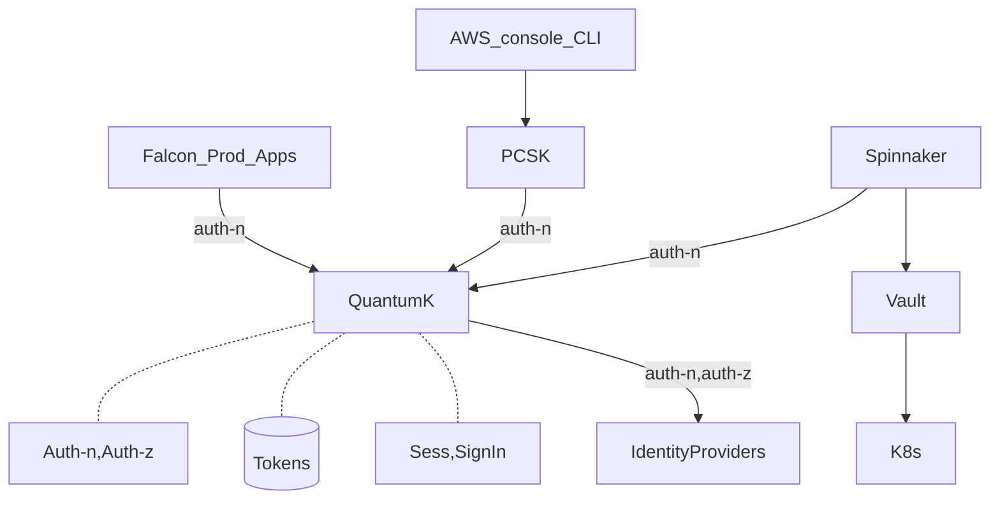

# Cross References
- [[Tool - Vault]]
- [[Task -QuantumK - Nimbus]]
- [[Tool - Technology - NorthStars]] : Security section


# Certificates vs Secrets
-  Examples
	- Certificates: PKI, SSL Certificate
	- Secrets: db passwords and username;  JWT Tokens
- Details
	- Secrets: 
		- Provides secure storage of secrets, such as passwords and database connection strings. For more information. 
		- Secrets on the other hand tend ==to be long-lived==. Secrets are symmetric keys so both client and server need to know about it
	- Certificates: 
		- Built on top of keys and secrets and add an automated renewal feature.
		- Certificate assertions are ==usually short-lived== (Eg.** **5 to 10 minutes) so if even if intercepted they will provide only limited use


#  SSL/TLS Certificate
- SSL/TLS certificate enables secure connection using Secure Socket Layer/Transport Layer Security protocol (ie part of TCP-IP protocol stack)

- So what:
	on web browser
		if SSL autheticated, you get a padlock before url

		get https

		your page may get better ranking during search optimizations


- How it works
	(Step 1) Verify identity of the 2 parties using PKI (Public Key Infrastructure)
		browser <--> certificate authority <--> web server

	(Step 2) public key cryptography
		-  two different keys to encrypt and decrypt a messag

		- send/encode: 
			encrypt(msg, public-key)

			public key: /Users/thomaschang/.certs_tls/thomaschang.crt

		- receive/decode:  
			(msg, private-key)

			private key: /Users/thomaschang/.certs_tls/thomaschang.p12


- Reference:
	https://aws.amazon.com/what-is/ssl-certificate/


# JWT Token
- Token is issued by a software token service (ie Keycloud, QuantumK)
- Used by client(app) and resource server (api backend) 
	- authenticate they are who 
	- pass msg between each securely

### Reference
1. https://jwt.io/introduction

### Formats
	- header . payload . signature

	- Header
		- alg is the encryption algorithm
	
```json 
{ "alg": "HS256", "typ": "JWT" }
```

	- Payload
		- Claims Claims are statements about an entity (typically, the user) and additional dat
		- Types of claims
			- registered
			- public
			- private
		- Example
```json
{ "sub": "1234567890", "name": "John Doe", "admin": true }
```

	- Signature	
```json
	HMACSHA256( base64UrlEncode(header) + "." + base64UrlEncode(payload), secret)
```
		


### Language Specific Libraries
- https://jwt.io/libraries


# Vault
- Refer to [[Tool - Vault]]


# KeyCloud / QuantumK
- Refer to [[Task -QuantumK - Nimbus]]
 
- Example of how QuantumK is used


- Keycloak is a SSO (single sign on) provider
	- ==IMOW: Keycloack enables a user to be logged in on all accounts | devices ==
	- It lets users authenticate via Keycloak rather than using individual applications. This means that their applications don't have to deal with login forms, authenticate users or store users
	- Single-sign out allows users to logout once to be logged out of all applications that use Keycloak
	- Vs Vault?
		- ==IMOW: Vault allows applications to retreive secrets and keys==
		- HashiCorp Vault enables fine-grained authorization to secrets and encryption keys that users and applications are permitted access to keys and secrets
	- Is QuantumK the authentication method in the Vault mental model? 
	- secret engine <- -> policies <- -> authentication
	- ==MAYBE?== : OIDC is the authentication mechanism 
		- Keycloak has been compared to Okta for SSO
		- Both are User Management and Authentication" and "Password Management
			- So it depends whether QuantumK uses only the user management/authentication, and not the password management
		- ```**Keycloak provides out-of-the-box authentication and authorization services** as well as advanced features like User Federation, Identity Brokering, and Social Login. Keycloak provides fine-grained authorization services as well.

- Authentication Protocols
	- OIDC
		- OpenID is an extension of OAuth 2.0
			- While OAUTH is only for authorization, OpenID is both authorization and authentication.
		- Uses Json Web Token (JWT)
	- SAML
		-XML based authetnication protocol , which relies on XML .
		
// -----------------------------------------------------------
//
// -----------------------------------------------------------

